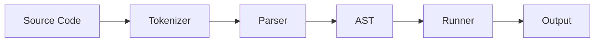
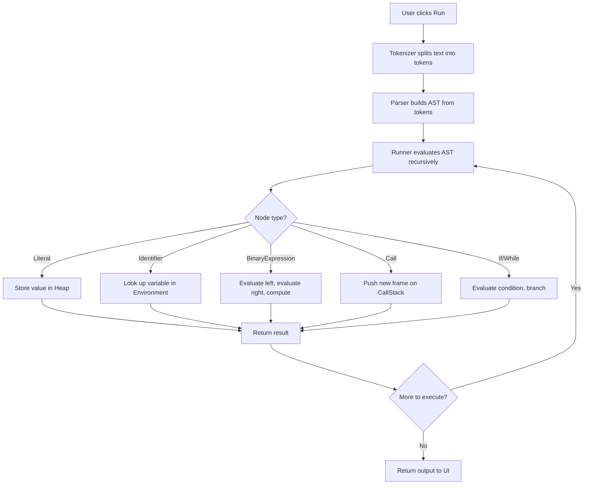
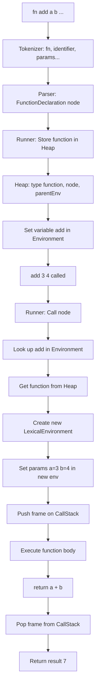
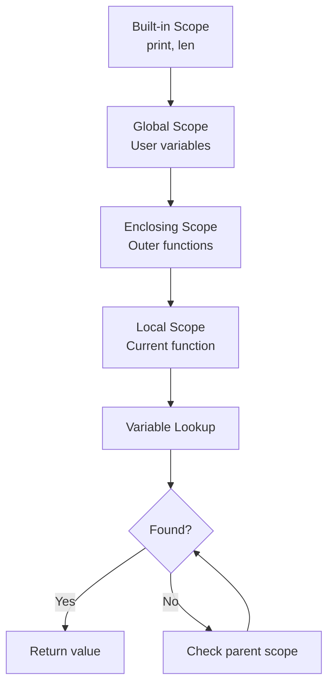
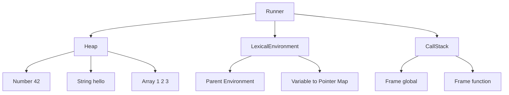

# 🧑‍💻 MiniLang — A Programming Language Interpreter

A fully-featured programming language built from scratch in TypeScript.
Includes a custom lexer, recursive descent parser, tree-walking interpreter,
and a VS Code-themed web playground with live token and AST visualization.

## 🎓 Technical Highlights

- **Compiler Design** — Hand-written Lexer, Recursive Descent Parser, AST construction
- **Recursive Descent Parsing** — Operator precedence with left-associativity
- **Tree-Walking Interpretation** — Recursive AST evaluation without intermediate bytecode
- **Lexical Scoping** — LEGB (Local → Enclosing → Global → Built-in) with closure support
- **Memory Management** — Custom heap with pointer-based reference semantics
- **Runtime Design** — Call stack with per-frame lexical environments
- **Debugger Features** — Live token visualization and collapsible AST tree inspector

## 🚀 Live Demo

[https://interpreter-ui.vercel.app/]

---

## 🛠️ Tech Stack

| Layer | Technology |
|-------|-----------|
| Language | TypeScript (strict mode) |
| Frontend | React 18 |
| Build Tool | Vite 5 |
| Styling | CSS-in-JS (inline styles) |
| Architecture | 4-panel IDE layout |

## 📦 Running Locally

```bash
# Install dependencies
npm install

# Start development server
npm run ui

# Build for production
npm run build

# Preview production build
npm run preview
```

## 📐 Grammar (Production Rules)

```
## 📐 Grammar (Production Rules)

```
program        → statement*

statement      → expression = expression ;
               | expression ;
               | if ( expression ) block ( else block )?
               | while ( expression ) block
               | fn identifier ( params? ) block
               | return expression? ;

block          → { statement* }

params         → identifier ( , identifier )*

expression     → orExpr

orExpr         → andExpr ( || andExpr )*

andExpr        → equalityExpr ( && equalityExpr )*

equalityExpr   → relationalExpr ( == | != relationalExpr )*

relationalExpr → additiveExpr ( < | > | <= | >= additiveExpr )*

additiveExpr   → multiplicativeExpr ( + | - multiplicativeExpr )*

multiplicative → unaryExpr ( * | / | % unaryExpr )*

unaryExpr      → ( ! | - | + ) unaryExpr | accessOrCall

accessOrCall   → atom ( . identifier | [ expression ] | ( args? ) )*

atom           → number | string | true | false | null | identifier
               | ( expression ) | [ elements? ] | { pairs? }

elements       → expression ( , expression )*

pairs          → pair ( , pair )*

pair           → ( identifier | [ expression ] ) : expression

args           → expression ( , expression )*

```

## 📝 Language Reference

### Variables & Assignment


x = 10;
name = "John";
flag = true;
empty = null;


### Data Types

| Type | Example | Description |
|------|---------|-------------|
| Number | `42`, `3.14` | Integer and decimal |
| String | `"hello"` | Double-quoted text |
| Boolean | `true`, `false` | Logical values |
| Null | `null` | Represents no value |
| Array | `[1, 2, 3]` | Ordered collection |
| Object | `{ name: "John" }` | Key-value pairs |

### Operators

#### Arithmetic
| Operator | Example | Result |
|----------|---------|--------|
| `+` | `5 + 3` | `8` |
| `-` | `10 - 4` | `6` |
| `*` | `3 * 7` | `21` |
| `/` | `20 / 5` | `4` |
| `%` | `10 % 3` | `1` |

#### String Concatenation

```minilang
greeting = "Hello " + "World";
print(greeting);
```

#### Comparison
| Operator | Meaning |
|----------|---------|
| `==` | Equal to |
| `!=` | Not equal to |
| `>` | Greater than |
| `<` | Less than |
| `>=` | Greater or equal |
| `<=` | Less or equal |

#### Logical
| Operator | Meaning |
|----------|---------|
| `&&` | Logical AND |
| `||` | Logical OR |
| `!` | Logical NOT |

```minilang
a = true;
b = false;
print(a && b);   
print(!a);       
print(!b); 
```

### Unary Operators
| Operator | Example | Result |
|----------|---------|--------|
| `!` | `!true` | `false` |
| `-` | `-5` | `-5` |
| `+` | `+5` | `5` |

### Operator Precedence (Lowest to Highest)

| Level | Operators |
|-------|-----------|
| 1 | `\|\|` |
| 2 | `&&` |
| 3 | `==` `!=` |
| 4 | `<` `>` `<=` `>=` |
| 5 | `+` `-` |
| 6 | `*` `/` `%` |
| 7 | `!` `-` `+` (unary) |
| 8 | `.` `[]` `()` (access/call) |

### Control Flow

#### If / Else If / Else

```minilang
x = 15;
if (x > 20) {
    print("Big");
} 
else if (x > 10) {
    print("Medium"); 
} 
else {
    print("Small");
}
```


#### While Loop

```minilang
i = 0;
while (i < 5) {
    print(i);
    i = i + 1;
}
``` 


### Functions

Functions are first-class values stored in the heap.

```minilang
fn add(a, b) {
    return a + b;
}
result = add(3, 4);
print(result); 
```


#### Closures
Functions capture their defining environment (lexical scoping):

```minilang
x = 10;
fn outer() {
    x = 20;

    fn inner() {
        print(x); 
    }
    inner();
}
outer();
print(x); 
```

### Arrays

```minilang
arr = [1, 2, 3, 4, 5];

print(arr[0]); 
print(arr[2]);

arr[1] = 99;
print(arr[1]);
```

### Objects

```minilang
user = { name: "John", age: 30 };

print(user.name); 
print(user["age"]); 

user.name = "Jane"; 
user.city = "NYC"; 
print(user.city); 
```

## 🧠 Scoping — LEGB Rule

Variables are resolved using the **LEGB** (Local → Enclosing → Global → Built-in) scoping chain.

Each function call creates a new **LexicalEnvironment** with a pointer to its parent.
This enables closures — inner functions can access outer function variables even after the outer function returns.

## 🏗️ Architecture

### Pipeline



### Project Structure

| Directory | File | Description |
|-----------|------|-------------|
| `fe/` | `ast.ts` | AST node type definitions (20+ types) |
| `fe/` | `tokenizer.ts` | Hand-written lexer (text → tokens) |
| `fe/` | `parser.ts` | Recursive descent parser (15 precedence levels) |
| `be/` | `runner.ts` | Tree-walking interpreter |
| `be/` | `memory.ts` | Heap, LexicalEnvironment, CallStack |
| `be/` | `builtin.ts` | Built-in functions (print) |
| `be/` | `utils.ts` | UUID generator |
| `components/` | `Editor.tsx` | Code editor with line numbers |
| `components/` | `OutputPanel.tsx` | Output panel with line numbers |
| `components/` | `TokenView.tsx` | Colored token table |
| `components/` | `ASTView.tsx` | Collapsible AST tree viewer |

### Execution Flow



### Function Execution Flow



### Scoping Chain (LEGB)



### Memory Model



## 📝 Example Programs

### Hello World
```minilang
print("Hello World!");
```

### Fibonacci (Recursive)
```minilang
fn fib(n) {
    if (n <= 1) {
        return n;
    }
    return fib(n-1) + fib(n-2);
}
print(fib(10));
```

### Factorial

```minilang
fn fact(n) {
    if (n <= 1) {
        return 1;
    }
    return n * fact(n-1);
}
print(fact(5));
```

### Closure Example
```minilang
fn makeCounter() {
    count = 0;
    fn increment() {
        count = count + 1;
        return count;
    }
    return increment;
}
counter = makeCounter();
print(counter());  
print(counter());  
print(counter());
```

### Array Manipulation
```minilang
arr = [1, 2, 3];
arr[1] = 99;
print(arr);          
print(arr[0]);       
```

### Object Manipulation
```minilang
person = { name: "Alice", age: 25 };
person.age = 26;
person.city = "NYC";
print(person.name);
print(person["age"]);
```
